DieBieSlave - Hardware
===
# Introduction
During my work at the University of Twente at the faculty of Biomechanical Engineering I gained interest in EtherCAT and its applications. I learned that many of the projects at this faculty (and other faculties in the field of robotics) desire a custom coupling between a unique sensor and EtherCAT, a coupling that is not always easy to realise with the existing slaves. During my work I helped designing an EtherCAT slave based on the ET1100, this ASIC comes in a BGA package, needs two external ethernet phy's and lots of passive components. The ET1100 is more than capable of coupling all desired applications to EtherCAT however in some applications it's to cumbersome to implement knowing that the LAN9252 can do almost the same and has the ASIC + 2 Phy's intergrated in one QFN package. 

Knowing about the existence of the LAN9252 and hearing the need for a "sensor <--> EtherCAT" interface motivated me to design the project presented here; the DieBieSlave, a universal EtherCAT slave that is able to couple 'any' I2C, SPI, UART, analog, digital or CAN based sensor to EtherCAT. The idea is that the DieBieSlave is universal for any sensor application and has all the 'complex' EtherCAT, power supply and microcontroller hardware on one PCB whilst the only thing that differs per sensor implementation is a cheap and simple daughter board. Every sensor of course needs its unique code to initialise and sample the sensor. 

The DieBieSlave looks like this:
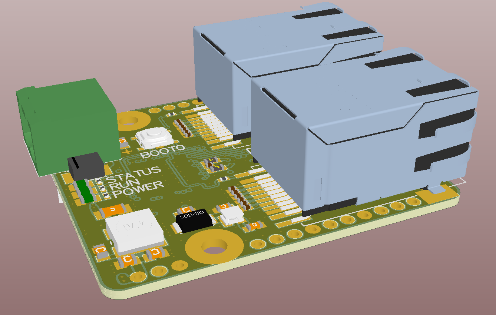
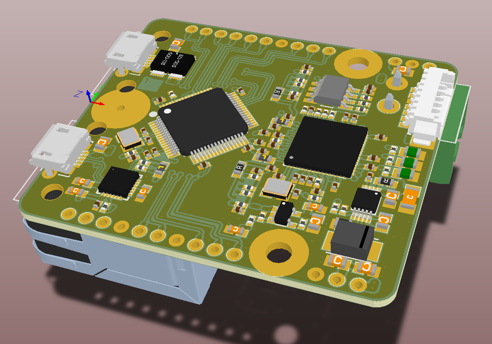
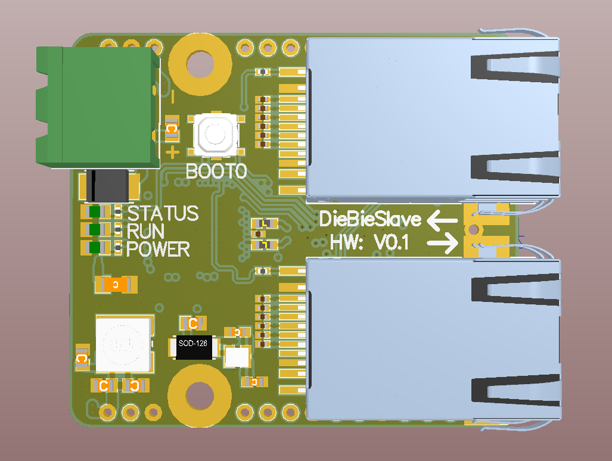
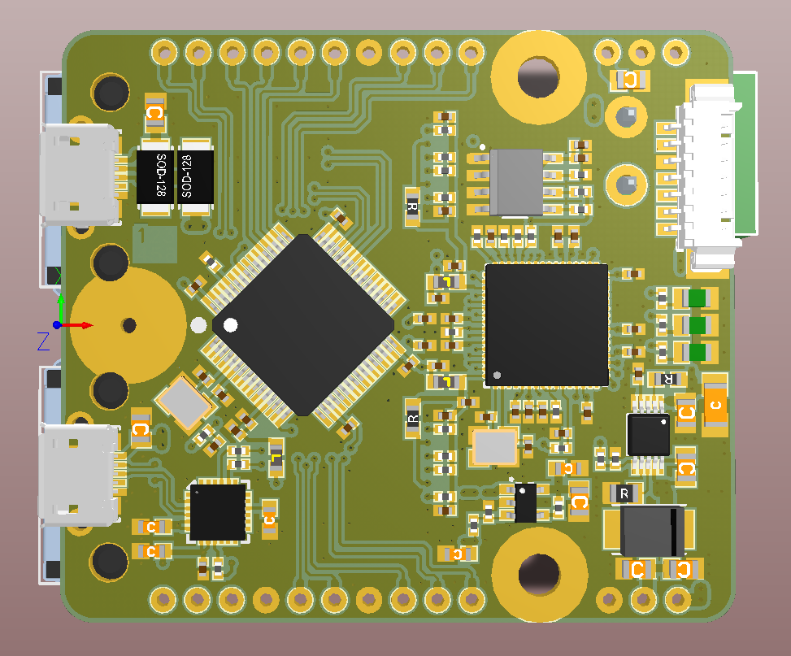

On the topside you can see:
* DC (10-30V) power input jack.
* EtherCAT input/output connectors 
* EtherCAT, power and software status LEDs
* BOOT0 HW serial bootloader enable button

On the bottom:
* Micro USB connector that is connected to the HW serial UART1 for general serial communication and HW Bootloader
* Micro USB connector that is connected to the HW USB peripheral of the STM32F303RET6
* 7Pin picoblade debug connector that is connected to the SWD and UART2 peripheral of the STM32F303RET6.

Both sides:
The holes on both edges of the DieBieSlave interface to all exposed (I2C, SPI, UART, analog, digital and CAN) peripherals on the STM32F303RET6 and should be connected to the desired target sensor. Standard 2.54mm headers can be soldered to both sides of the DieBieSlave allowing the use of standard 2.54mm male/female headers to connect standaard prototype board to either the small area on top or the full area on the bottom (realising either a compact or extensive interface). The board connected to the pin on te side that interfaces to a sensor is called a daughter board.

More details can be found in the schematic [here](/Project%20Outputs%20for%20DB10012_UniversalSlave/DB10012_DieBieSlave.PDF).

### Latest hardware release (production files)

* V0.1 Initial hardware
   This version has the following bug:
   * The INT pint of the LAN9252 was incorrectly connected to PC5 (cannot be muxed to INT input when I2C INT input also used) but should have been connected to PB0 (allows INT functionality at all times). This bug is fixxed in V0.2.
   
* V0.2 Fixed version of V0.1 with added functionality (current version)
   This version has some added functionality:
   * The DC-DC power input 10-30V is also routed to the header pins, now the DieBieSlave can be powered by the daughter board if desired.
   
Production data for most recent version can be found [here](Project%20Outputs%20for%20DB10012_UniversalSlave). And the schematic in PDF [here](DB10012_UniversalSlave.PDF).

### Features
The DieBieSlave is designed in such a way that it is easy to manufacture and has a relatively small footprint (by a professional). The implementation of a daughter board is completely up to the user. The DieBieSlave PCB has the following features:

* Power LED on both sides of the PCB.
* EtherCAT RUN LED on both sides of the PCB.
* Sofware status LED on both sides of the PCB connected to pin PB15.
* DC input range of 10-30V (possibly broader but untested) allowing simple implementation in 12V and 24V systems.
* Onboard +5V and +3V3 SMPS power supplies that are exposed to the daughter board header.
* Large powerful microcontroller with DSP and FPU STM32F303RET6 (cortex-M4 512Kbytes flash and 64Kbyte SRAM).
* RJ45 EtherCAT in and output connectors.
* LAN9252 QFN based EtherCAT ASIC.

### Electrical specifications
* DC input power range 10-30V reverse polarisation protected
* The +5V power supply can deliver up to 400mA
* The +3V3 power supply  can deliver up to 200mA

# Realisation
As stated in the introduction the DieBieSlave is a universal EtherCAT slave implementation that will always need a daughter board supplying the DieBieSlave with information that should be put on the BUS. An example DieBieSlave and daughter board implementation is given here:
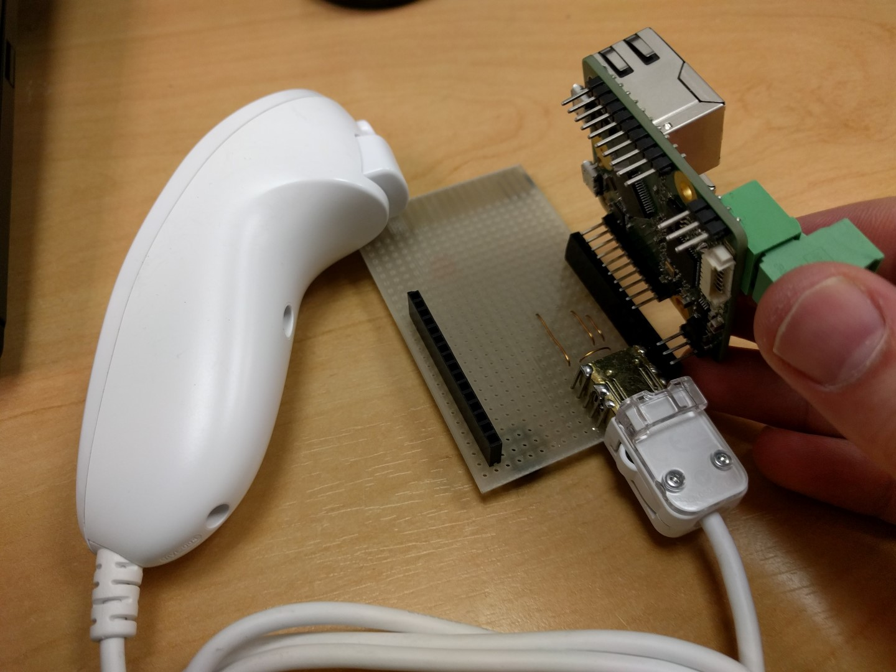

As seen the daughter board can be anything from standard perforated prototype board up to a custom designed board carrying the sensor. 

#### LAN9252 vs ET1100
Altrough the LAN9252 seems a perfect replacement for the ET1100 with its two embedded phy's, the QFN package and its low amount of external components it has a big drawback on the software side. Whilst the ET1100 has a transparant interface to its internal RAM over SPI the LAN9252 has not and needs some form of adres translation that prevents large chunks of (PDO) data to be written in a single block, this prevents the use of DMA syncing between uC and LAN9252. The only alternative is rather software labour intensive (the adres translation needs to be done in software) compared to its DMA alternative. This is no deal breaker for sensor acquisition (sensors need very little processor power) but will be a drawback in realtime systems like motor controllers.

#### Used technology
The IC's used with their corresponding functionality:
* STM32F303RET6 -> Main microcontroller.
* LAN9252/ML -> EtherCAT slave controller with build-in phy's.
* M24C16-WMN6P -> EEPROM for LAN9252
* LM25011MY/NOPB -> DC power input to +5V converter.
* LMR10510XMFE/NOPB -> +5V to +3V3 converter.
* 74980111211 -> RJ45 connectors with integrated magnetics.
* CP2104-F03-GM -> USB serial converter for bootloader and general serial communication.

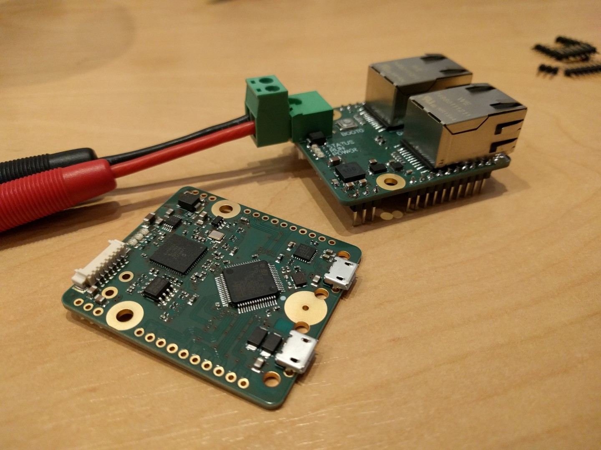
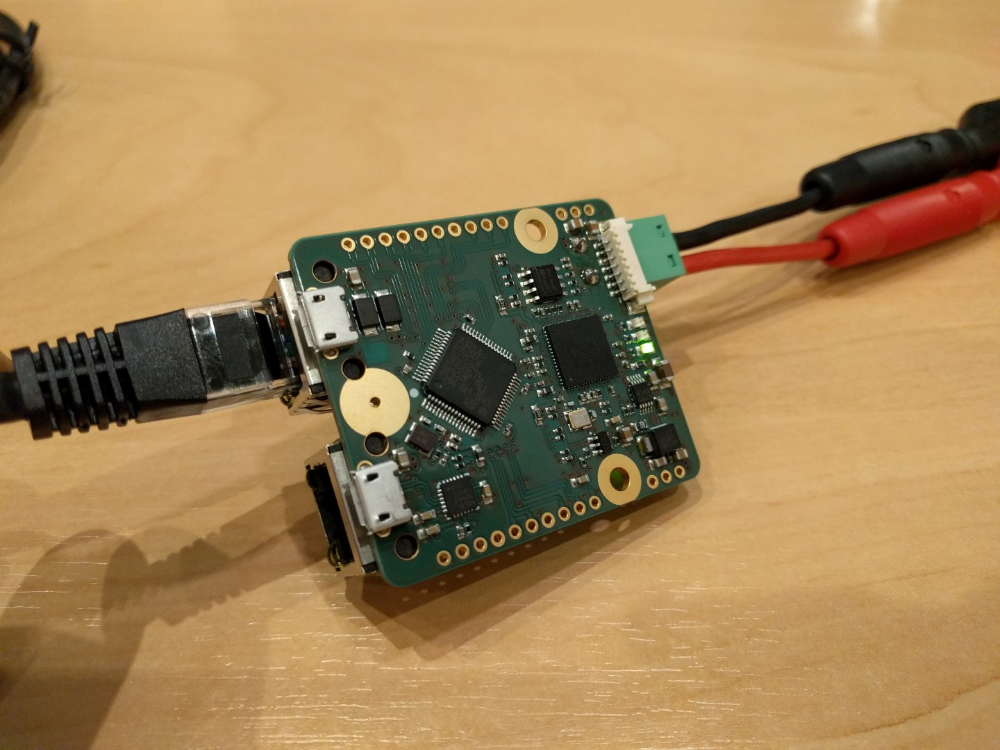
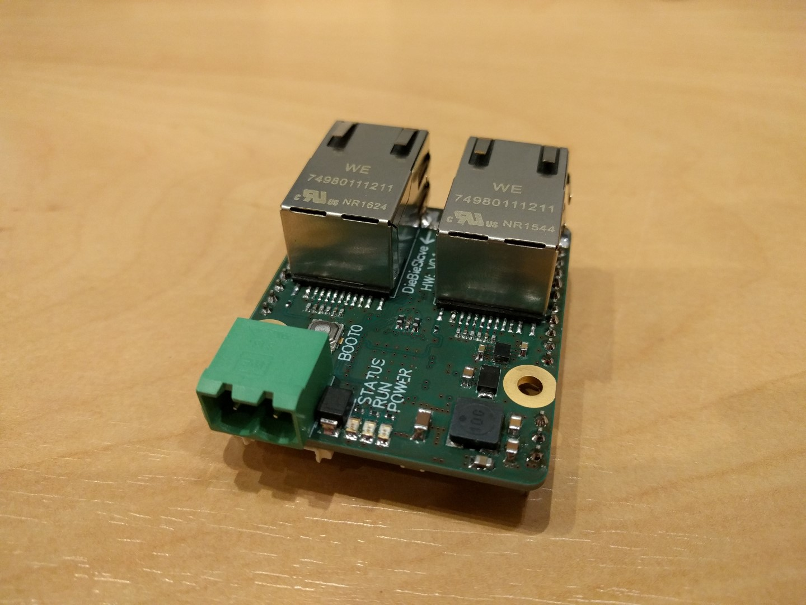
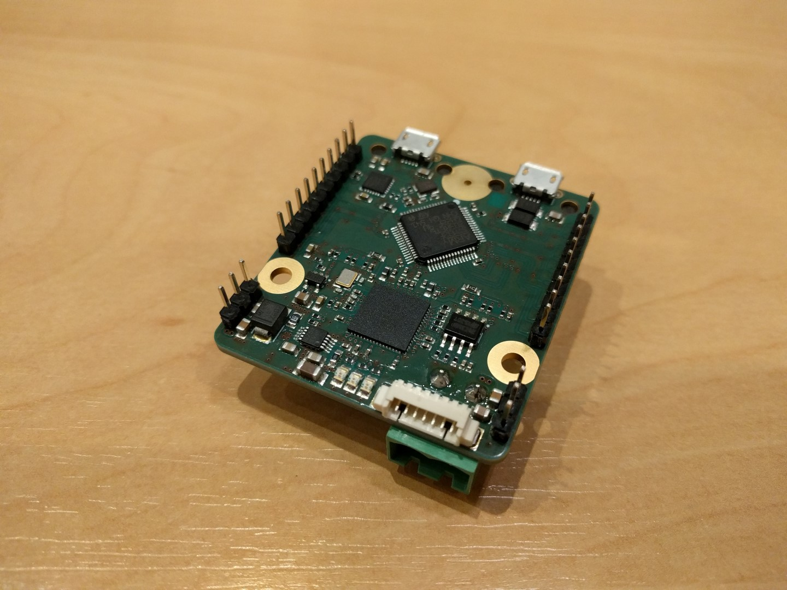
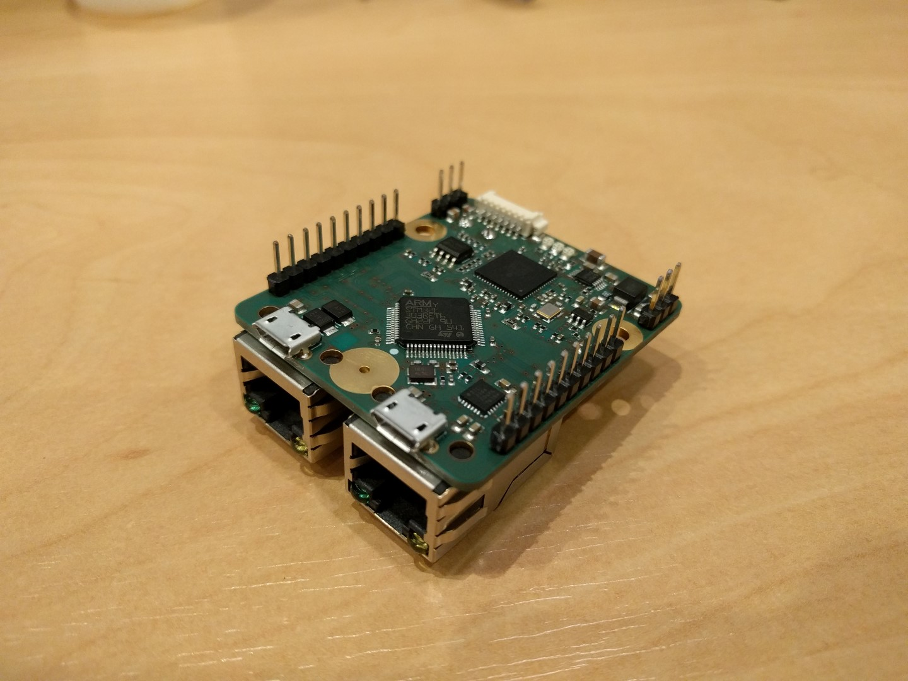

# Example usage
#### MPU9250/NunChuck to EtherCAT
Interfacing a Nun-chuck controller and MPU9250 sensors with EtherCAT:

#### More pictures
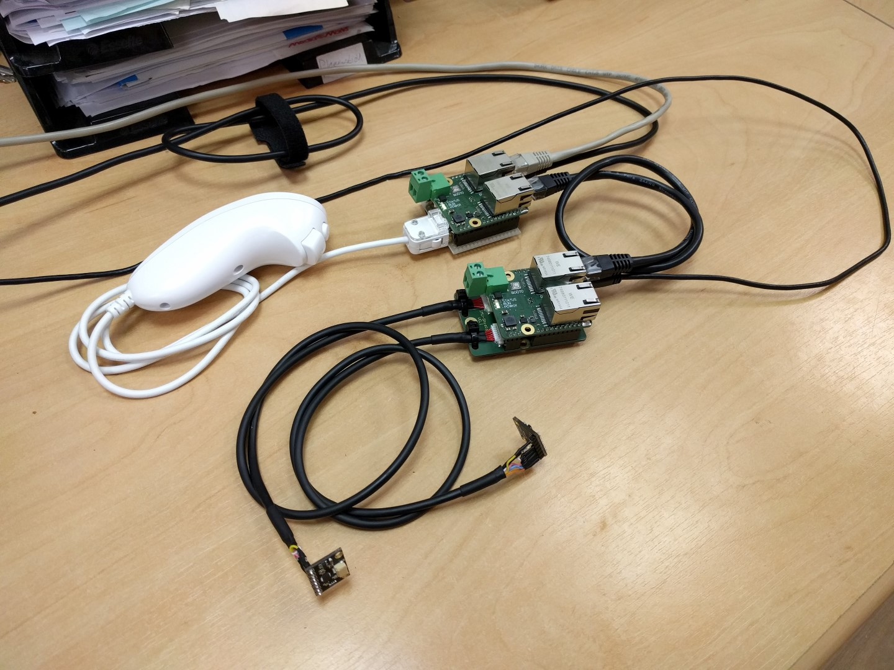
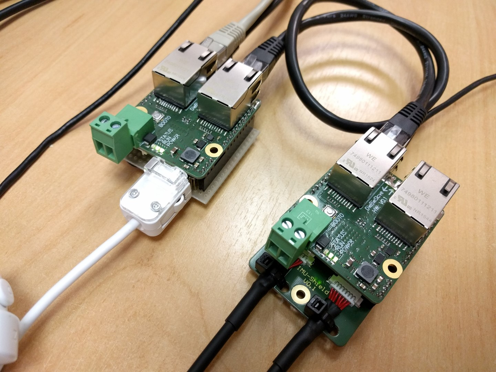
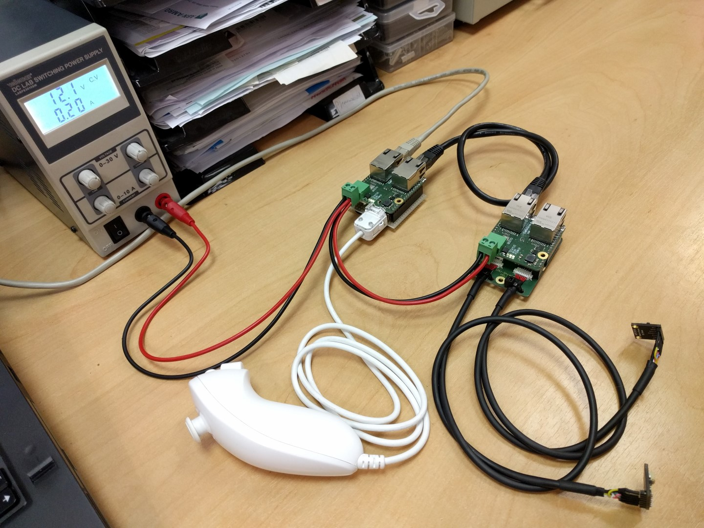
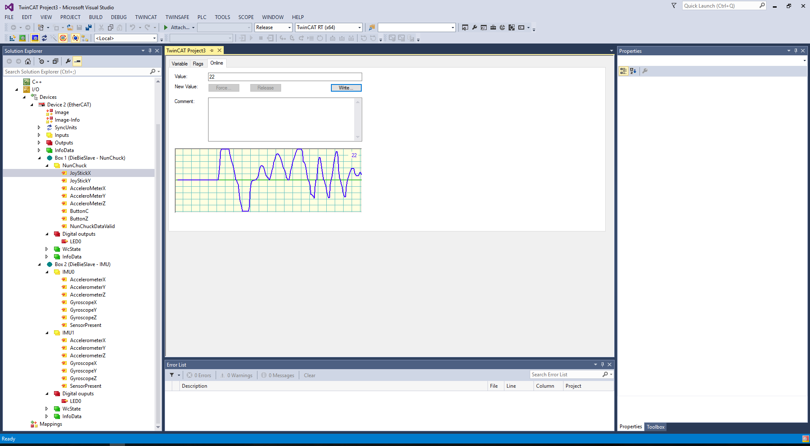
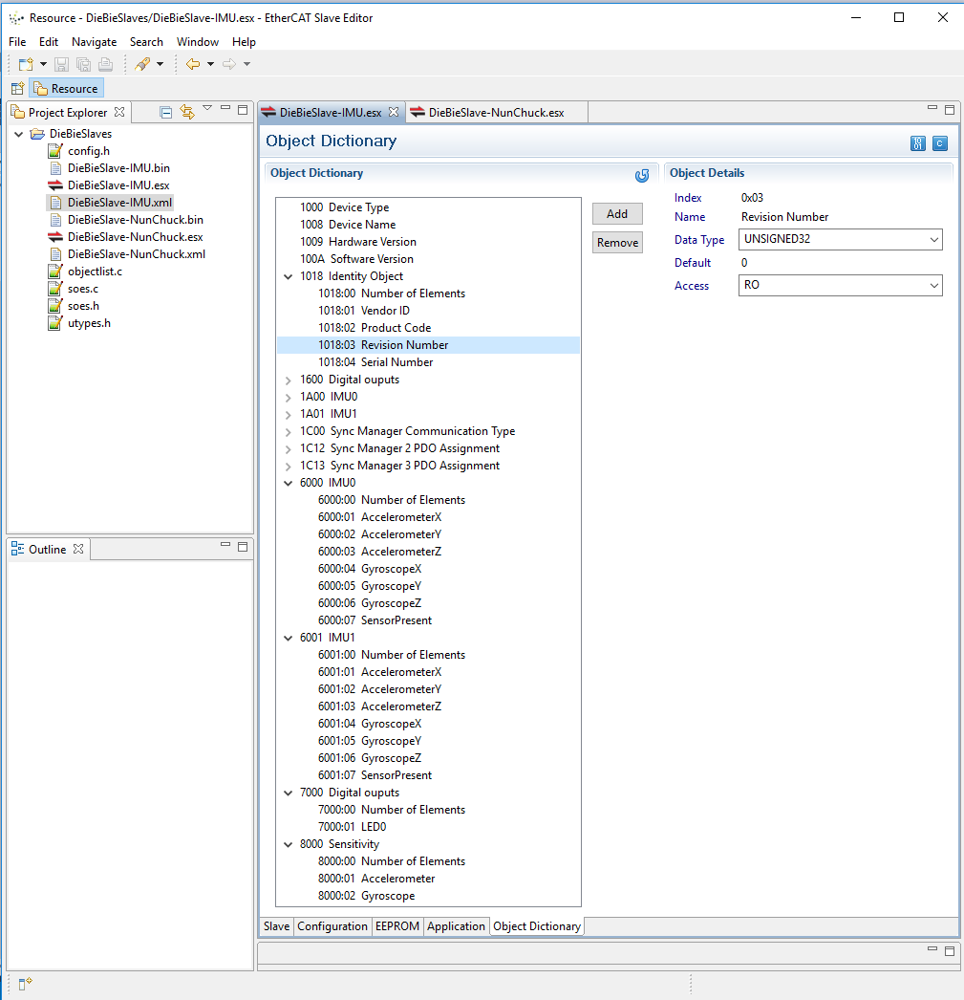
